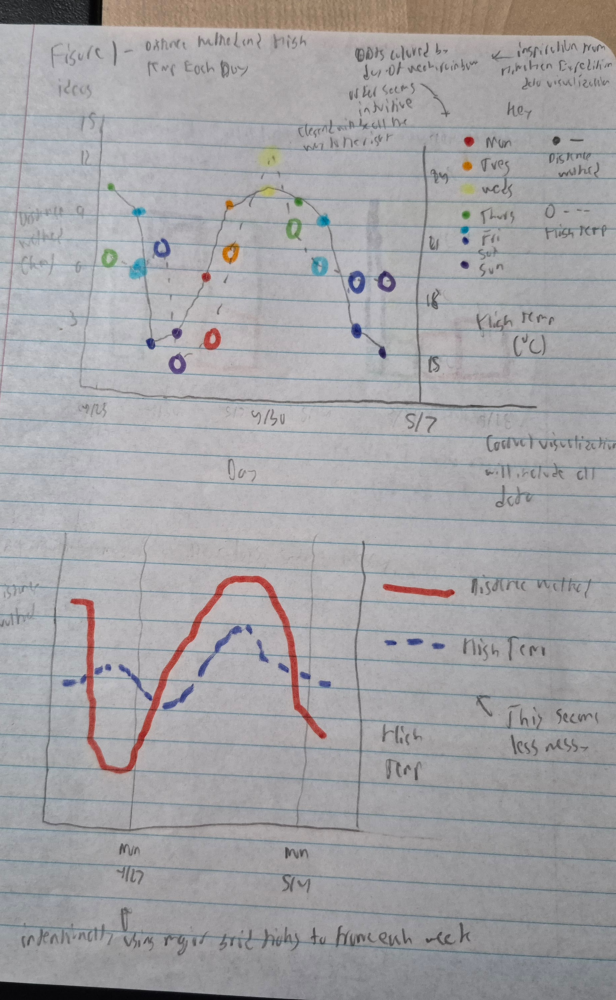
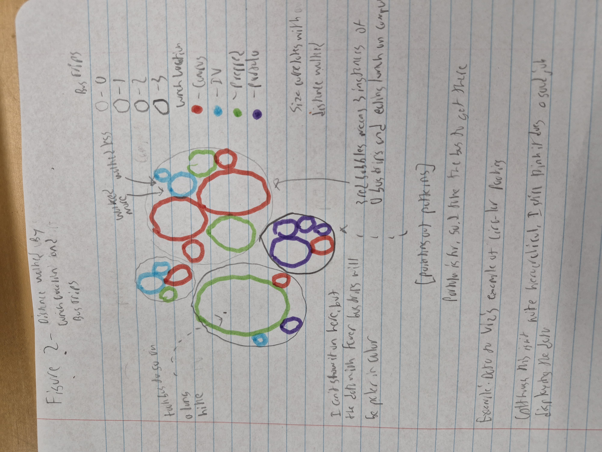
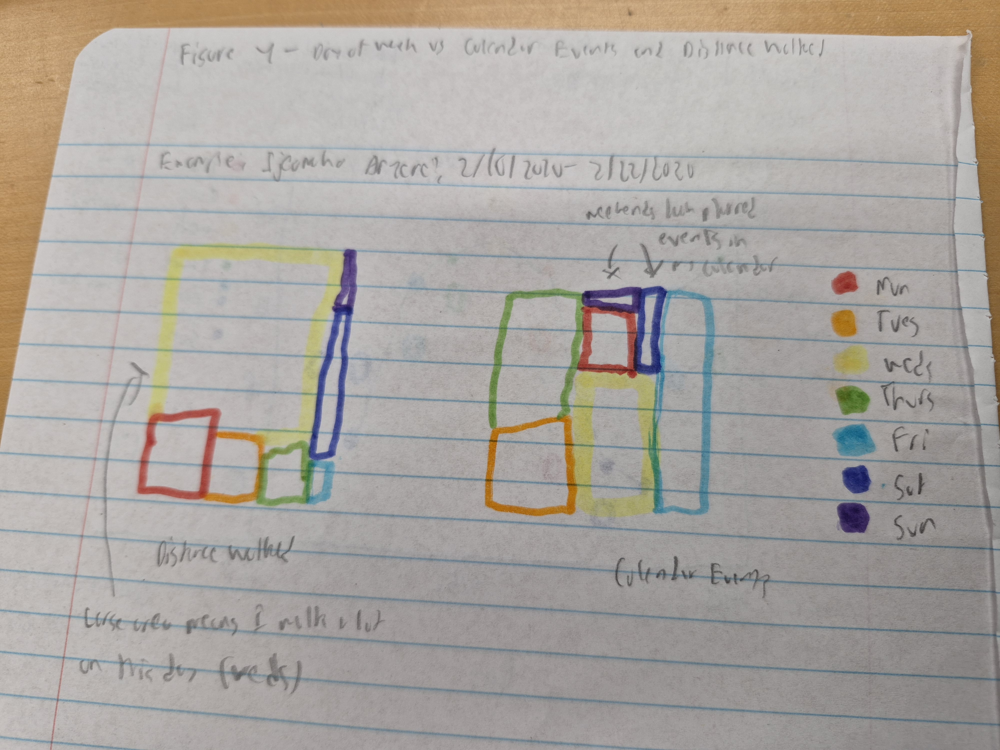

# Visualization Notes

## Data Types

Categorical Variables: Day of Week, Lunch Location

Numeric Variables: Date (discrete), **Distance Walked (continuous)**, Bus Trips (discrete), Calendar Events (discrete), Temperature (continuous)

## Displays

An obvious chart is a *Line Chart* (timeseries) using date and distance walked. This will satisfy the requirement for a visualization we used in class.

Another obvious one is to create a *Histogram* or *Density Chart* of the distribution for distance walked. I like the latter more since it creates a more smoothed look.

The date and day of the week variables present an interesting set of variables to work with. They open the opportunity for an array of time series charts, but they are also ordered data in that the days of the week clearly have an order to them. 

Although day of the week is categorical, it is ordered and can be treated as numeric (ex: Monday - 1, Tuesday - 2). Sums/means/etc are useless here, but the ordering is useful as it can be used to create a time series where the average walking distance for each day of the week is shown.

Using data to viz (https://www.data-to-viz.com/), I am working with two numeric variables in which one is ordered. 

Of these, I think the *Connected Scatter Plot* works best for my data. I could see a *Lollipop Chart* with a deliberate ordering for days of the week also work.

Of course, I could still treat daty of the week as categorical, not numeric. Here, the *Ridgeline Plot* works well. The one for each day of the week could be paired with one for the whole data to see if any interesting patterns come up (ex: multiple modes that correspond to certain days of the week).

Something I worry about is the sample size for each category being too small (4 or 5, since it'll be around 30 data points split among 7 categories). A solution is to group days of the week into weekdays and weekends. 

I also want to visualize how multiple variables contribute to distance walked, so I need a plot that can handle 3 variables at once. An idea I like is a *Bubble Plot* where the x-axis is day of the week, the y-axis is one of the confounding variables and the bubble size is distance walked.

If both of the predictors have a small number of groups (ex: weekday/weekend and lunch location), a *Circular Packing Chart* or something similar could be interesting. The idea is that two larger circles would break things down by category, and within those, the circle size could indicate distance walked. Alternatively, a *Dendrogram* could work if I want the data in a more structured format.

There are also some interesting plots to consider that do not use distance walked, as I think some of the confounding variables may have interesting relationships. 

A timeseries could be used to plot temperature in relation to date to get a sense of weather patterns. Actually, this could be a double time series, it'd be cool to see how this relates to distance walked.

Day of the week and calendar events likely show some interesting correlation, and I like the idea of a *Heat Map* for these. I could even throw in a third variable like lunch location. Color intensity could indicate how frequently the day of the week-calendar event combination shows up, and each lunch location could correspond to a specifc color (ex: Campus - Red, IV/Portola - Blue, Prepped - Green and use RGB scaling to generate a color). A *Grouped Scatter* is also an option.

The heat map is also another way to relate two confounding variables to the distance walked.

Summary of pre-emptive choices:

**Just Looking at Distance Walked**
Line chart (timeseries). Alternatives: Density Chart

**Looking at Confounding Variables Effects on Distance Walked**
Circular Packing Chart. Alternatives: Dendrogram, Bubble Plot

**Looking at Just Confounding Variables**
Heat Map. Alternatives: Grouped Scatter

## Sketch Planning

### Figure 1

Chart Type: Line Chart (timeseries)

X-axis: Date

Y-axis 1: Distance Walked

Y-axis 2: Temperature

Customization: Color by day of the week, arrows to point out some notable points (ex: couldn't track data on my camping trip due to no signal), custom font, custom images for temperatures (ex: heat vs cold icons)

### Figure 2

Chart Type: Circular Packing Chart

Bubble Layer 1: Lunch Location, distinguished by color

Bubble Layer 2: Bus Trips (there's not a lot of numbers I ended up getting, so I can treat this as categorical here), distinguished by color

Bubble Layer 3: Distance walked, distinguished by size of layer 2

Customization: Labels, custom font, arrow pointing out the most noticeable pattern

### Figure 3

Chart Type: Heat Map

X-axis: Day of Week

Y-axis: Calendar Events (width of 2, so that it's 0-1, 2-3, 4-5, etc)

Color Intensity: Number of times that x-y combination shows up

Color Spectrum: Distance walked, where green is high and red is low

Customization: May need to adjust days of the week if there's too many white cells, custom font, arrows to point out interesting trends

`Note:` I decided to use a pair of treemaps for the above instead after doing further exploration of what others have done; I think this will work better than a heat map at showing if calendar events correlates with distanced walked.

I am tentatively deciding to go with figures 1, 2 and 4.

**Figure 1**

Note that I am using the bottom one for figure 1 as I think it is cleaner.

**Figure 2**

**Figure 4**

# Coding Decisions

## Figure 1

Dropped the temperature data, I couldn't figure out a way to do this without doing a dual axis with completely different units (distance unit vs a temperature unit). This would've made the chart too confusing, and I didn't see any interesting patterns.

## Figure 2

Switched from circular packing to a tree map since I was having issues getting the circular packing package to load, and these both convey the same information